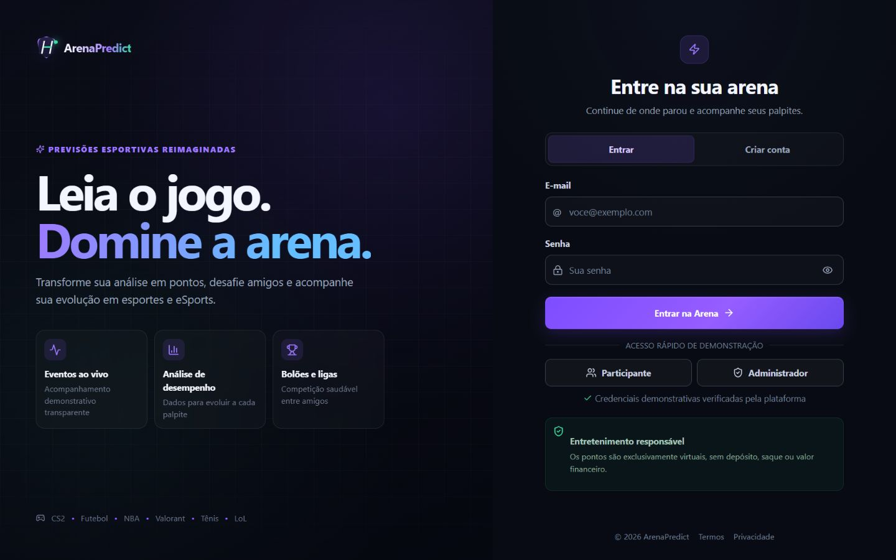
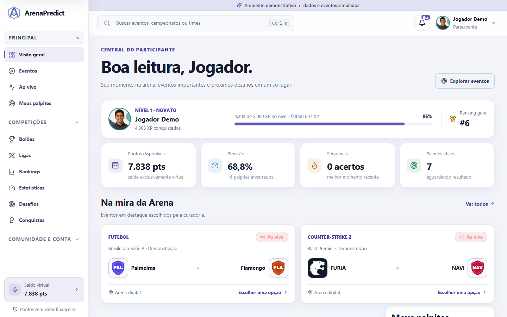
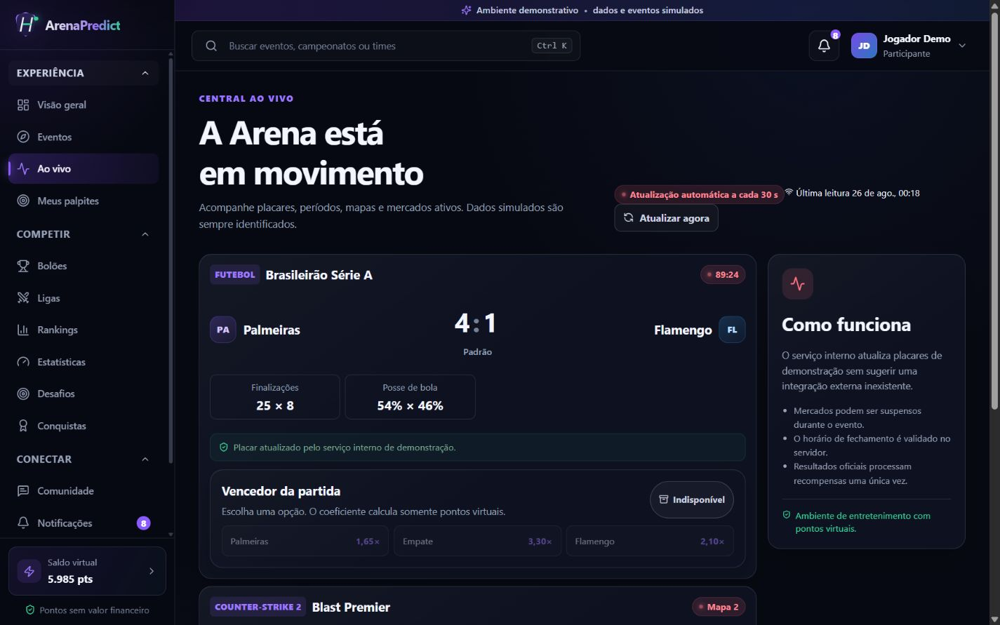
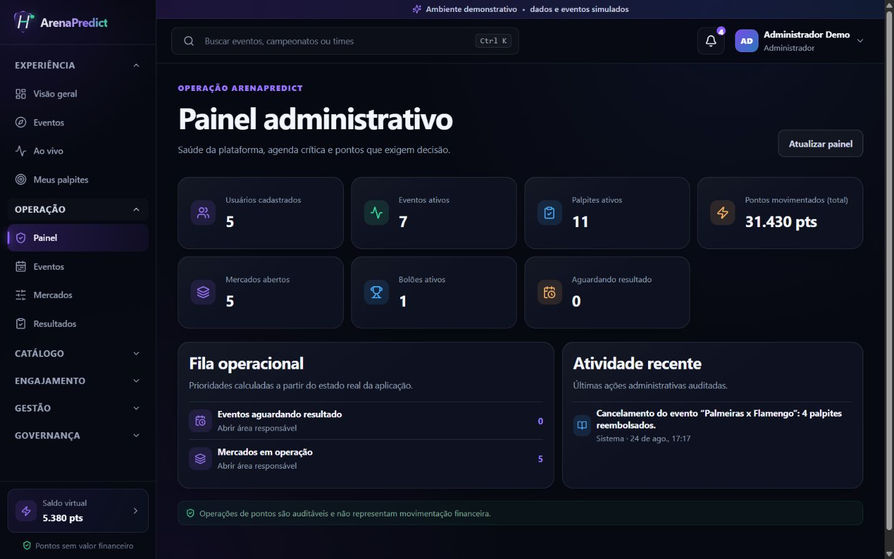
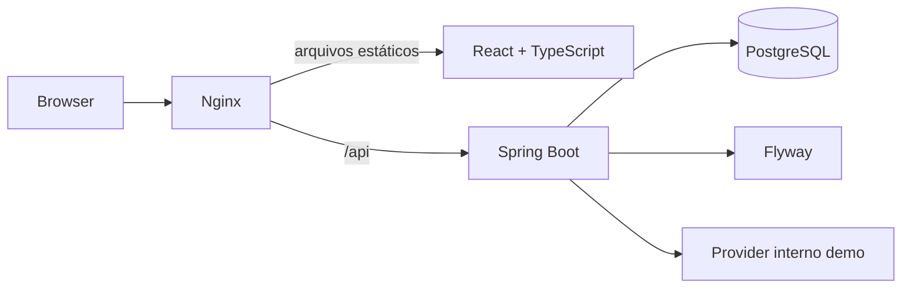

# ArenaPredict

Plataforma full stack de previsões esportivas e de eSports com pontos exclusivamente virtuais, gamificação e uma superfície administrativa abrangente.

> **Transparência:** o ArenaPredict não processa dinheiro, depósitos, saques ou prêmios financeiros. Pontos, multiplicadores e recompensas são recursos fictícios de entretenimento e demonstração de portfólio, sem valor monetário.

O projeto demonstra uma aplicação SaaS de ponta a ponta: domínio transacional em Java, autenticação e autorização, persistência relacional, experiência responsiva em React, infraestrutura Docker e testes das regras críticas.

## Visão geral

O ArenaPredict organiza modalidades, campeonatos, participantes, eventos e mercados de previsão em um único produto. Participantes acompanham eventos, registram palpites com saldo virtual, evoluem na plataforma e competem em rankings e ligas. Administradores operam catálogo, resultados, engajamento, moderação e governança.

Principais capacidades:

- eventos futuros, ao vivo e finalizados;
- mercados configuráveis e multiplicadores simulados;
- palpites com débito, reembolso e recompensa em pontos virtuais;
- carteira e razão append-only nos fluxos da aplicação;
- bolões, ligas e rankings;
- XP, níveis, desafios e conquistas;
- notificações, comunidade e moderação;
- dashboards para participante e administrador;
- resultados e liquidação idempotente;
- API documentada com OpenAPI;
- dados ao vivo simulados, sempre identificados como demonstração.

## Screenshots

| Acesso | Visão do participante |
|---|---|
|  |  |

| Eventos ao vivo | Operação administrativa |
|---|---|
|  |  |

### Identidade visual

O tema claro é o padrão, com superfícies neutras, acentos índigo e feedbacks
semânticos. O tema escuro continua disponível pelo menu do perfil e a escolha
fica persistida no navegador. Eventos usam o componente reutilizável
`TeamLogo`: ele prioriza `logoUrl` vindo do catálogo, resolve os quatro aliases
demonstrativos conhecidos (Palmeiras, Flamengo, Team Vitality e G2 Esports) e
troca qualquer imagem indisponível por iniciais acessíveis. As fontes e os
créditos dos logos estão documentados em
[`frontend/public/assets/teams/README.md`](frontend/public/assets/teams/README.md).

## Arquitetura



O frontend é servido pelo Nginx, que também encaminha `/api/*` ao backend. O Spring Boot concentra autenticação, autorização, validações e transações. O PostgreSQL persiste o domínio; o Flyway controla sua evolução.

### Organização do backend

- `com.bolao.copa.arena.domain`: entidades e estados do domínio;
- `arena.repository`: persistência Spring Data JPA;
- `arena.service`: regras transacionais de eventos, palpites, pontos, ranking e engajamento;
- `arena.api`: contratos HTTP e endpoints;
- `security`: JWT, autenticação e respostas 401/403;
- `config`: CORS, segurança e inicialização demonstrativa.

O namespace legado `com.bolao.copa` permanece como fronteira técnica de migração. As funcionalidades atuais estão isoladas no módulo `arena`; o alias HTTP `/auth/**` é mantido apenas por compatibilidade, enquanto o cliente atual usa `/api/auth/**`.

### Organização do frontend

- `app`: marca, formatadores e apresentação de estados;
- `components`: shell, cards e componentes reutilizáveis;
- `contexts`: sessão, dados globais e feedback;
- `hooks`: carregamento e controle de requisições;
- `pages`: experiências de participante e administração;
- `services`: cliente HTTP tipado;
- `types`: contratos compartilhados pela interface.

## Stack

| Camada | Tecnologias |
|---|---|
| Frontend | React 18, TypeScript, Vite, React Router, Lucide |
| Testes frontend | Vitest, Testing Library, jsdom |
| Backend | Java 21, Spring Boot 3, Spring Web, Spring Security |
| Persistência | Spring Data JPA, Hibernate, PostgreSQL 16, Flyway |
| Segurança | JWT, BCrypt, RBAC, Bean Validation, CORS explícito |
| Documentação | Springdoc OpenAPI / Swagger UI |
| Infraestrutura | Docker, Docker Compose, Nginx |
| Observabilidade local | Spring Boot Actuator e healthchecks do Compose |

## Perfis

| Perfil | Experiência |
|---|---|
| Participante | Dashboard, eventos, ao vivo, palpites, carteira, rankings, bolões, desafios, conquistas, comunidade, notificações e perfil |
| Administrador | KPIs, catálogo, eventos, mercados, resultados, usuários, engajamento, moderação, relatórios, auditoria e configurações |

As permissões são aplicadas no backend. Esconder uma rota no frontend não substitui a autorização da API.

## Regras principais

### Palpites e pontos

- um palpite só pode ser criado em evento e mercado abertos;
- o backend valida o prazo de fechamento;
- o valor deve ser inteiro e respeitar o mínimo do mercado;
- a carteira é bloqueada durante o débito para evitar corrida de saldo;
- saldo insuficiente não gera palpite ou movimentação parcial;
- a chave de idempotência impede submissões duplicadas;
- cancelamentos permitidos devolvem os pontos;
- eventos cancelados reembolsam palpites ativos;
- a recompensa usa o multiplicador registrado no momento do palpite;
- repetir a liquidação não credita a recompensa novamente;
- cada movimentação registra valor, saldo final, referência e data.

### Gamificação

XP, nível, sequência, precisão, desafios e conquistas são calculados a partir da atividade e das recompensas do participante. O saldo inicial e os reembolsos não contam como XP. Cada desafio recorrente guarda a janela que originou o progresso; ao iniciar uma nova janela, ele pode ser concluído e recompensado novamente, uma única vez. Recompensas continuam sendo exclusivamente virtuais e são protegidas contra processamento duplicado.

## Modo demonstração

O modo demo é explícito e controlado por `APP_DEMO_ENABLED`. Ele cria um conjunto pequeno de modalidades, campeonatos, participantes, eventos, mercados, palpites, liga, notificações e conteúdo comunitário. O runtime do backend mantém o modo demo desativado por padrão; o `docker-compose.yml` o ativa deliberadamente para a apresentação local. A interface usa `VITE_DEMO_MODE`, que deve permanecer alinhada ao backend.

O provider ao vivo incluído é interno e simulado. O projeto não afirma integração com ESPN, Sportradar, FIFA, Riot, Steam ou provedores de odds.

O seed pode ser executado novamente sem duplicar os registros conhecidos e não redefine a senha de uma conta demo que já existe no banco persistido.

Credenciais destinadas somente ao ambiente local:

| Perfil | E-mail | Senha |
|---|---|---|
| Administrador | `admin@arenapredict.com` | `Admin@123` |
| Participante | `jogador@arenapredict.com` | `Jogador@123` |

Nunca publique uma instância com credenciais demo, segredo JWT ou senha de banco padrão.

## Execução com Docker

Pré-requisitos:

- Docker Desktop ou Docker Engine;
- Docker Compose v2.

Na raiz do repositório:

```bash
docker compose config
docker compose up -d --build
docker compose ps
```

Serviços:

- aplicação: <http://localhost:5173>
- API: <http://localhost:8080>
- Swagger UI: <http://localhost:8080/swagger-ui.html>
- saúde da API: <http://localhost:8080/actuator/health>
- saúde do frontend: <http://localhost:5173/health>

Por segurança, as portas da aplicação e da API são vinculadas a `127.0.0.1` por padrão. Para um teste deliberado em outro dispositivo da rede local, defina `APP_BIND_ADDRESS=0.0.0.0` e ajuste também `CORS_ALLOWED_ORIGINS`; não exponha a configuração demo à internet.

Logs:

```bash
docker compose logs -f backend frontend postgres
```

Encerramento sem apagar o banco:

```bash
docker compose down
```

O volume PostgreSQL é persistente. `docker compose down -v` remove os dados e só deve ser usado deliberadamente em um ambiente descartável.

## Desenvolvimento local

### Backend

Requer Java 21, Maven e uma instância PostgreSQL acessível. O `.env` da raiz é lido pelo Docker Compose, não pelo Maven. Para reutilizar somente o banco do Compose, expondo-o em `127.0.0.1:5433`, execute:

```bash
docker compose up -d postgres
```

Depois exporte `DB_URL`, `DB_USERNAME`, `DB_PASSWORD` e um `JWT_SECRET` com pelo menos 32 caracteres no shell que executará o Maven. Ative `APP_DEMO_ENABLED=true` apenas quando quiser carregar os fixtures locais.

```bash
cd backend
mvn spring-boot:run
```

### Frontend

Requer Node.js 22, também registrado em `.nvmrc`.

O Vite lê variáveis de `frontend/.env.local`. Para desenvolvimento fora do Compose, configure ali `VITE_BACKEND_PROXY=http://localhost:8080` e, se necessário, os valores de marca listados em `.env.example`. `VITE_API_TIMEOUT_MS` controla o timeout do cliente HTTP em milissegundos.

```bash
cd frontend
npm ci
npm run dev
```

Por padrão, o Vite encaminha `/api` para <http://localhost:8080>. O arquivo `.env` da raiz continua reservado ao Compose.

## Configuração

Use `.env.example` como referência. O arquivo `.env` local não deve ser versionado.

| Grupo | Variáveis principais |
|---|---|
| Produto | `APP_BRAND_NAME`, `VITE_APP_NAME`, `VITE_APP_SHORT_NAME`, `VITE_APP_TAGLINE`, `VITE_APP_DESCRIPTION`, `VITE_APP_STORAGE_NAMESPACE`, `VITE_SUPPORT_EMAIL` |
| Demonstração | `APP_DEMO_ENABLED`, `APP_DEMO_LIVE_PROVIDER_ENABLED`, `APP_DEMO_LIVE_SCHEDULER_ENABLED`, `APP_DEMO_LIVE_REFRESH_MS`, `APP_DEMO_LIVE_INITIAL_DELAY_MS`, `VITE_DEMO_MODE` |
| Segurança | `JWT_SECRET`, `JWT_EXPIRATION_MINUTES`, `CORS_ALLOWED_ORIGINS` |
| Banco | `POSTGRES_DB`, `POSTGRES_USER`, `POSTGRES_PASSWORD`, `POSTGRES_VOLUME_NAME`, `POSTGRES_HOST_PORT` |
| Rede/frontend | `APP_BIND_ADDRESS`, `FRONTEND_PORT`, `BACKEND_PORT`, `VITE_API_URL`, `VITE_BACKEND_PROXY`, `VITE_API_TIMEOUT_MS` |

`VITE_*` é incorporada ao bundle no build; alterá-la exige reconstruir o frontend. `VITE_BACKEND_PROXY` é usado apenas pelo servidor de desenvolvimento, enquanto o Compose encaminha `/api` pelo Nginx.

`VITE_SUPPORT_EMAIL` define apenas o endereço exibido e copiado pela central de ajuda; não existe integração externa de atendimento. Em uma implantação real, substitua o valor demonstrativo por uma caixa monitorada.

## Segurança

- senhas protegidas com BCrypt;
- sessão stateless com JWT;
- perfis normalizados e RBAC no backend;
- endpoints administrativos protegidos por autorização;
- DTOs e Bean Validation na fronteira HTTP;
- entidades JPA não expostas diretamente;
- respostas JSON distintas para 401 e 403;
- CORS limitado a origens explícitas;
- inicialização interrompida quando o segredo JWT está ausente ou tem menos de 32 bytes;
- transações em débito, reembolso e recompensa;
- locks e chaves de idempotência nas regras críticas;
- registro append-only de operações administrativas críticas, com ator, recurso e ID de correlação, sem senha ou token;
- headers de segurança no Nginx;
- mensagens inesperadas não expõem stack trace ao cliente.

Para uma implantação pública ainda são necessários gestão externa e rotação de segredos, TLS no proxy de borda, rate limiting distribuído, política de backup e monitoramento centralizado.

## Migrations

O Flyway é a fonte de verdade do schema. O Hibernate usa `ddl-auto=validate`, portanto não altera tabelas silenciosamente.

| Versão | Responsabilidade |
|---|---|
| V1 | Baseline compatível e núcleo ArenaPredict: modalidades, campeonatos, participantes, eventos, mercados, pontos, palpites, ligas e notificações |
| V2 | Perfil, preferências, progressão, conquistas, desafios e comunidade |
| V3 | Hardening relacional com chaves estrangeiras, validações e índices |
| V4 | Tipos de bolão/liga e janelas de desafios |
| V5 | Participantes genéricos de evento, incluindo formatos além de confronto casa/fora |
| V6 | Auditoria administrativa e correção da progressão derivada do razão de pontos |
| V7 | Recibos idempotentes de resultados/classificações, recorrência de desafios e XP baseado em atividade |

Instalações existentes preservam estruturas legadas apenas para compatibilidade de migração; fora do alias de autenticação documentado acima, elas não fazem parte da superfície funcional atual.

## Testes

Backend:

```bash
cd backend
mvn -B verify
```

Frontend:

```bash
cd frontend
npm ci
npm run typecheck
npm run test:run
npm run build
```

Os testes existentes exercitam autenticação, claims JWT, 401/403, permissões, seed, carteira, saldo insuficiente, débito, cancelamento, idempotência, resultados por placar e classificação, liquidação, recompensa única, progressão recorrente, comunidade e formatos seguros dos recursos administrativos.

O workflow `.github/workflows/ci.yml` executa backend e frontend em jobs independentes, com Java 21 e Node.js 22. O pipeline apenas valida o código; não publica artefatos nem realiza deploy.

## API

Rotas de participante incluem dashboard, modalidades, campeonatos, eventos, palpites, carteira, bolões, rankings, notificações, perfil, conquistas, desafios e comunidade.

Rotas sob `/api/admin/**` cobrem dashboard, catálogo, eventos, mercados, resultados, usuários, bolões, pontuação, engajamento, moderação, relatórios, auditoria e configurações.

Consulte o Swagger UI para payloads, validações, enums internos e respostas atuais. Faça login em `/api/auth/login` e use o botão **Authorize** com o JWT retornado para testar rotas protegidas.

## Limitações conhecidas

- o provider esportivo incluído é demonstrativo e não consome fonte externa;
- o perfil automatizado de integração usa H2 em modo compatível com PostgreSQL; o smoke test final também foi executado contra PostgreSQL real, mas essa paridade ainda deve entrar no CI com Testcontainers;
- ainda não há suíte E2E automatizada com navegador;
- usuários, bolões, regras de pontuação e configurações são visões administrativas operacionais somente para consulta nesta versão; catálogo, eventos, mercados, resultados, engajamento, notificações e moderação possuem ações próprias;
- logout remove o JWT do cliente, sem lista distribuída de revogação;
- métricas, logs e traces ainda não são enviados a uma plataforma central;
- estruturas legadas permanecem no baseline para migração, mas não são expostas pelo runtime;
- o projeto não oferece nem planeja conversão de pontos em dinheiro.

## Próximos passos

- adicionar testes E2E dos fluxos participante e administrador;
- executar integrações contra PostgreSQL real em CI;
- ampliar cobertura de auditoria e correlação de requisições;
- adicionar métricas, tracing e dashboards operacionais;
- automatizar backup e restauração testada;
- integrar um provider esportivo apenas quando houver contrato real e configuração explícita;
- adotar rotação de segredos e rate limiting para cenários públicos.

## Posicionamento técnico

O ArenaPredict foi construído para demonstrar domínio full stack sem esconder seus limites: regras transacionais no backend, autorização efetiva, persistência versionada, interface responsiva, dados demo transparentes e uma base preparada para evolução incremental — sem confundir pontos virtuais com apostas financeiras.
