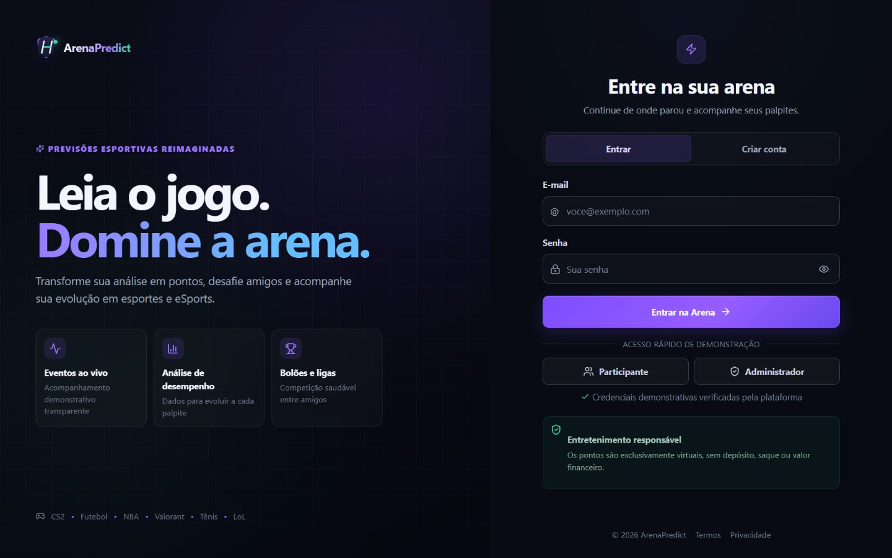
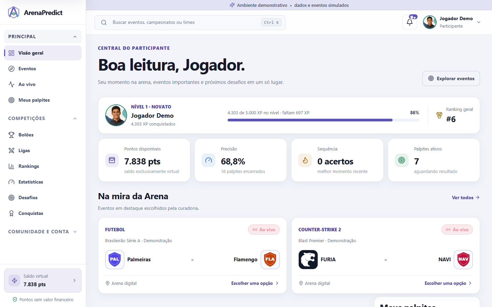
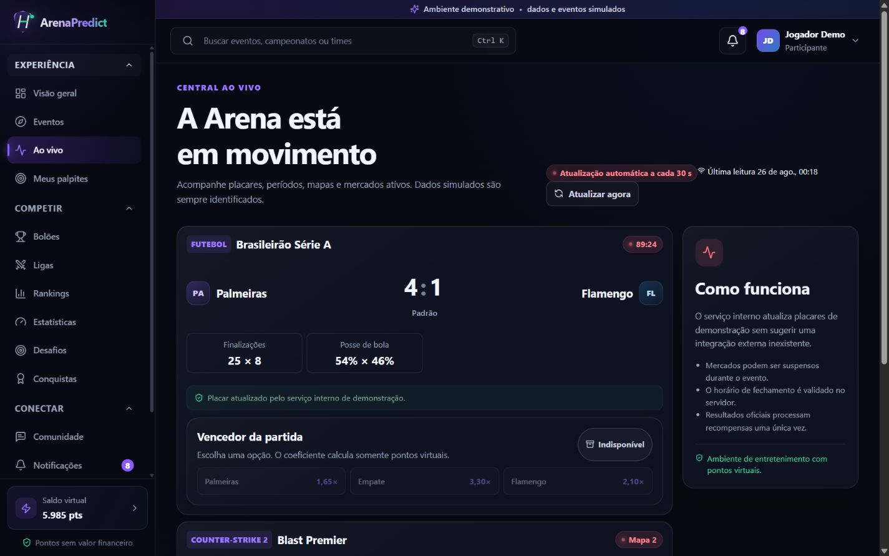
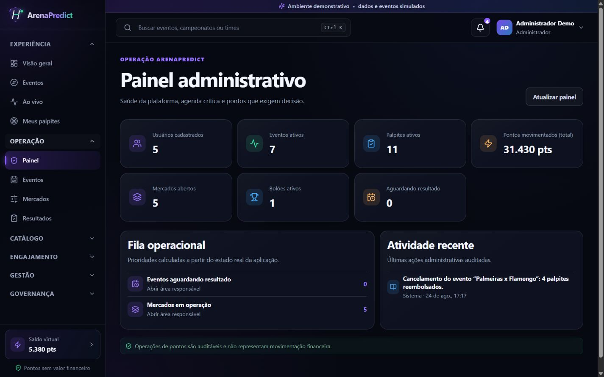
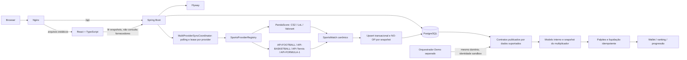

# Arena Predict

Plataforma full-stack de previsões esportivas com pontos virtuais, dados esportivos reais, competições, comunidade, gamificação e backoffice administrativo.

> **Transparência:** o ArenaPredict não processa dinheiro, depósitos, saques ou prêmios financeiros. Pontos, multiplicadores e recompensas são recursos fictícios de entretenimento e demonstração de portfólio, sem valor monetário.

O projeto demonstra uma aplicação SaaS de ponta a ponta: domínio transacional em Java, autenticação e autorização, persistência relacional, experiência responsiva em React, infraestrutura Docker e testes das regras críticas.

## Visão geral

O ArenaPredict organiza modalidades, campeonatos, participantes, eventos e mercados de previsão em um único produto. Participantes acompanham eventos, registram palpites com saldo virtual, evoluem na plataforma e competem em rankings e ligas. Administradores operam catálogo, resultados, engajamento, moderação e governança.

Principais capacidades:

- eventos futuros, ao vivo e finalizados;
- mercados configuráveis e multiplicadores simulados;
- palpites com débito, reembolso e recompensa em pontos virtuais;
- carteira e razão append-only nos fluxos da aplicação;
- bolões, ligas e rankings;
- XP, níveis, desafios e conquistas;
- notificações, comunidade e moderação;
- dashboards para participante e administrador;
- resultados e liquidação idempotente;
- API documentada com OpenAPI;
- integração CS2 com PandaScore: calendário, equipes, campeonatos e resultados automáticos;
- eventos reais e Demo identificados separadamente; placar de série ao vivo quando fornecido pelo plano.

## Screenshots

| Acesso | Visão do participante |
|---|---|
|  |  |

| Eventos ao vivo | Operação administrativa |
|---|---|
|  |  |

### Identidade visual

O tema claro é o padrão, com superfícies neutras, acentos índigo e feedbacks
semânticos. O tema escuro continua disponível pelo menu do perfil e a escolha
fica persistida no navegador. Eventos usam o componente reutilizável
`TeamLogo`: ele prioriza o logo fornecido pela API, usa assets locais como fallback e transforma qualquer
identidade sem arquivo distribuível em um escudo determinístico com iniciais
acessíveis. Falhas de imagens externas não deixam imagens quebradas. A política dos assets
está documentada em
[`frontend/public/assets/teams/README.md`](frontend/public/assets/teams/README.md).

## Arquitetura


```mermaid
flowchart LR
    B[Browser] --> N[Nginx]
    N -->|arquivos estáticos| R[React + TypeScript]
    N -->|/api| S[Spring Boot]
    S --> P[(PostgreSQL)]
    S --> F[Flyway]
    R -->|lê snapshots, não consulta fornecedores| S
    S --> C[MultiProviderSyncCoordinator: polling e lease por provider]
    C --> G[SportsProviderRegistry]
    G --> X[PandaScore: CS2 / LoL / Valorant]
    G --> A[API-FOOTBALL / API-BASKETBALL / API-Tennis / API-FORMULA-1]
    X --> M[SportsMatch canônico]
    A --> M
    M --> U[Upsert transacional e NO-OP por snapshot]
    U --> P
    P --> T[Contratos publicados por dados suportados]
    T --> I[Modelo interno e snapshot do multiplicador]
    I --> L[Palpites e liquidação idempotente]
    L --> W[Wallet / ranking / progressão]
    D[Orquestrador Demo separado] -->|mesmo domínio, identidade sandbox| T
```

O frontend é servido pelo Nginx, que também encaminha `/api/*` ao backend. O Spring Boot concentra autenticação, autorização, validações e transações. O PostgreSQL persiste o domínio; o Flyway controla sua evolução. Os adapters reais estão implementados, mas aguardam credenciais: **não há prova de chamada autenticada nem provider anunciado como operacional**. Consulte a [matriz de cobertura, limitações e ativação](docs/provider-coverage.md) e a [auditoria anterior às alterações](docs/productization-audit.md).

### Organização do backend

- `com.bolao.copa.arena.domain`: entidades e estados do domínio;
- `arena.repository`: persistência Spring Data JPA;
- `arena.service`: regras transacionais de eventos, palpites, pontos, ranking e engajamento;
- `arena.api`: contratos HTTP e endpoints;
- `security`: JWT, autenticação e respostas 401/403;
- `config`: CORS, segurança e inicialização demonstrativa.

O namespace legado `com.bolao.copa` permanece como fronteira técnica de migração. As funcionalidades atuais estão isoladas no módulo `arena`; o alias HTTP `/auth/**` é mantido apenas por compatibilidade, enquanto o cliente atual usa `/api/auth/**`.

### Organização do frontend

- `app`: marca, formatadores e apresentação de estados;
- `components`: shell, cards e componentes reutilizáveis;
- `contexts`: sessão, dados globais e feedback;
- `hooks`: carregamento e controle de requisições;
- `pages`: experiências de participante e administração;
- `services`: cliente HTTP tipado;
- `types`: contratos compartilhados pela interface.

## Stack

| Camada | Tecnologias |
|---|---|
| Frontend | React 18, TypeScript, Vite, React Router, Lucide |
| Testes frontend | Vitest, Testing Library, jsdom |
| Backend | Java 21, Spring Boot 3, Spring Web, Spring Security |
| Persistência | Spring Data JPA, Hibernate, PostgreSQL 16, Flyway |
| Segurança | JWT, BCrypt, RBAC, Bean Validation, CORS explícito |
| Documentação | Springdoc OpenAPI / Swagger UI |
| Infraestrutura | Docker, Docker Compose, Nginx |
| Observabilidade local | Spring Boot Actuator e healthchecks do Compose |

## Perfis

| Perfil | Experiência |
|---|---|
| Participante | Dashboard, eventos, ao vivo, palpites, carteira, rankings, bolões, desafios, conquistas, comunidade, notificações e perfil |
| Administrador | KPIs, catálogo, eventos, mercados, resultados, usuários, engajamento, moderação, relatórios, auditoria e configurações |

As permissões são aplicadas no backend. Esconder uma rota no frontend não substitui a autorização da API.

O produto conserva páginas próprias para cada domínio. Visão geral resume a atividade;
Eventos, Ao vivo, Palpites, Bolões, Ligas, Rankings, Estatísticas, Desafios, Conquistas,
Comunidade e Minha conta continuam exploráveis individualmente. O backoffice agrupa
Operação, Catálogo, Engajamento, Gestão e Governança em seções recolhíveis, com drawer no mobile.
Bolão é um grupo social criado pelo participante; liga é uma temporada pública organizada
pela plataforma, com período obrigatório e classificação automática dos palpites elegíveis.

## Regras principais

### Palpites e pontos

- um palpite só pode ser criado em evento e mercado abertos;
- o backend valida o prazo de fechamento;
- o valor deve ser inteiro e respeitar o mínimo do mercado;
- a carteira é bloqueada durante o débito para evitar corrida de saldo;
- saldo insuficiente não gera palpite ou movimentação parcial;
- a chave de idempotência impede submissões duplicadas;
- cancelamentos permitidos devolvem os pontos;
- eventos cancelados reembolsam palpites ativos;
- a recompensa usa o multiplicador registrado no momento do palpite;
- repetir a liquidação não credita a recompensa novamente;
- cada movimentação registra valor, saldo final, referência e data.

### Gamificação

XP, nível, sequência, precisão, desafios e conquistas são calculados a partir da atividade e das recompensas do participante. O saldo inicial e os reembolsos não contam como XP. Cada desafio recorrente guarda a janela que originou o progresso; ao iniciar uma nova janela, ele pode ser concluído e recompensado novamente, uma única vez. Recompensas continuam sendo exclusivamente virtuais e são protegidas contra processamento duplicado.

## Modo demonstração

O acesso rápido reutiliza duas contas persistidas e o mesmo JWT do login convencional, sem enviar senhas ao navegador. Participante Demo entra na Visão geral; Administrador Demo entra no backoffice completo em modo de consulta. A jornada guiada fica em `/demo`, com uma **Competição de Demonstração** exclusiva, acessível pelo menu da conta, pelo dashboard e pela área de resultados:

1. Entre como **Participante Demo** e escolha um placar na partida disponível.
2. Revise os pontos virtuais e confirme o palpite; ele permanece salvo após atualizar a página.
3. Troque para **Administrador Demo** na própria jornada e use **Iniciar partida Demo**. O backend encerra os palpites.
4. Use **Simular resultado**, escolha o placar final e confirme.
5. Retorne ao participante e confira o palpite processado, os pontos recebidos e o ranking.
6. Como administrador Demo, use **Começar nova rodada** para repetir a experiência.

**O modo demonstração simula apenas o evento externo de conclusão da partida. Resultado, processamento dos palpites, pontuação e ranking utilizam as mesmas regras de negócio da aplicação.** O reset arquiva a rodada anterior, reembolsa palpites ativos e cria uma nova rodada. Preserva histórico e lançamentos de pontos; o ranking da competição volta ao histórico de exemplo. As contas e a rodada são compartilhadas entre visitantes, com proteção transacional contra comandos repetidos ou desatualizados.

Ative `APP_DEMO_ENABLED=true`, `APP_DEMO_CONTROLLED_ENABLED=true` e `VITE_DEMO_MODE=true`. Backend e Compose mantêm `APP_DEMO_ENABLED=false` por padrão; o `.env.example` o ativa para apresentação local. O catálogo demonstrativo existente permanece disponível para consulta. Partidas Demo ao vivo expiram em 15 minutos sem inventar resultado, com reembolso dos palpites ativos.

O provider Demo continua interno e simulado. A integração opcional PandaScore sincroniza partidas reais de CS2, League of Legends e Valorant exclusivamente pelo backend. Os dois fluxos têm identidades separadas: o Demo nunca simula resultados de partidas externas. Multiplicadores e pontos continuam sendo regras virtuais da aplicação, não odds da PandaScore.

Veja [arquitetura, permissões, reset, migrations e roteiro de teste da demonstração](docs/demo-flow.md).

O [fluxo de mercados reais de previsão](docs/real-prediction-markets.md) separa contratos pré-jogo e LIVE em CS2, Valorant e LoL. A PandaScore fornece resultados esportivos; o ArenaPredict define mercados liquidáveis e multiplicadores virtuais internos entre 1,10× e 8,00×, com origem e versão congeladas no palpite. Placar indisponível não impede o contrato de vencedor da série quando o resultado final é suportado.

## Integração esportiva real — eSports

Configure no `.env` privado do backend/Compose:

```dotenv
PANDASCORE_API_TOKEN=
SPORTS_SYNC_ENABLED=true
PANDASCORE_VIDEOGAMES=csgo,lol,valorant
PANDASCORE_LIVE_SCORES_ENABLED=false
```

Preencha o token somente no arquivo privado, com a credencial obtida no [painel PandaScore](https://app.pandascore.co/). O token nunca é uma variável `VITE_*`. Sem token, a aplicação e o modo Demo continuam funcionando e a área administrativa informa a indisponibilidade da sincronização. PandaScore cobre eSports. Futebol (`API_FOOTBALL_KEY`), basquete (`API_BASKETBALL_KEY`), tênis singles (`API_TENNIS_KEY`) e F1 (`API_FORMULA1_KEY`) têm adapters independentes, inicialmente desativados e sem credencial. Ative a flag `*_ENABLED=true` correspondente somente após configurar a chave privada e ajustar o orçamento ao plano; recrie o serviço `backend`. Não existe chave padrão ou fallback fictício.

A área técnica usa `GET /api/admin/sports-sync/providers`: capabilities, flag, presença de credencial, readiness, última tentativa, HTTP, sucesso, contadores e próxima execução por provider. O participante recebe apenas um resumo sanitizado em `/api/sports-sync/status`. `/api/events?page=0&size=24` pagina no banco e aceita `sport`, `status`, `source`, `championshipId`, `q`, `from` e `to`; limite de 48 por página. O contrato legado sem `page` é preservado. Dashboard e Ao vivo continuam lendo a mesma projeção de eventos LIVE, inclusive quando não há placar ou mercados.

Por padrão: próximas partidas a cada 15 minutos; jogos ao vivo e próximos de começar a cada 2 minutos; resultados recentes a cada 5 minutos. As frequências, timeouts, orçamento de requisições e janela de correções são configuráveis. Resultados válidos reutilizam a pontuação e o ranking existentes, com processamento transacional e idempotente.

O placar ao vivo não é garantido pelo plano de calendário. A opção de live score aceita apenas placares de série presentes na resposta REST; não implementa o stream de rounds/mapas via WebSocket. Nunca preenche ausência com `0 × 0`.

Veja [configuração, arquitetura, limitações, testes e atualização na EC2](docs/sports-integration.md). Correções de resultados já processados ficam em revisão auditável, sem duplicar créditos.

O [procedimento operacional](docs/real-sports-operations.md) distingue conectividade, autenticação real e testes com fixtures. `qa/check-pandascore.py` permite uma verificação manual server-side sem imprimir secrets; não é executado pela CI.

Credenciais operacionais devem existir apenas no gerenciador de segredos ou no arquivo `.env` não versionado do ambiente. Nunca publique segredo JWT ou senha de banco padrão. Administrador Demo consulta os módulos administrativos por uma lista explícita de endpoints; e-mails de usuários e conteúdo privado de notificações ficam protegidos. Comandos genéricos de administração continuam bloqueados para Demo. Somente os comandos do sandbox podem iniciar, simular e resetar sua rodada.

Participante Demo utiliza perfil, preferências, notificações, bolões demonstrativos e
comunidade Demo persistidos. Palpites em eventos externos ou reais continuam bloqueados
para essa identidade; contas pessoais conservam o fluxo normal. A comunidade identifica
posts Demo no banco e recusa IDs de posts reais em curtidas, comentários e denúncias Demo.
Alterar senha da conta compartilhada é bloqueado. Nenhum banner global substitui a identidade
esportiva: a identificação é contextual na conta, no evento, na competição e no post.
Rankings permitem selecionar Real, Demonstração ou ambas as origens; posições sempre vêm
de palpites liquidados persistidos.

Veja a [auditoria histórica e classificação dos módulos](docs/consolidation-audit-2026-10-04.md)
e o [relatório da consolidação](docs/consolidation-report-2026-10-04.md).

## Execução com Docker

Pré-requisitos:

- Docker Desktop ou Docker Engine;
- Docker Compose v2.

Na raiz do repositório:

```bash
cp .env.example .env
# Preencha POSTGRES_PASSWORD e JWT_SECRET com valores exclusivos antes de continuar.
docker compose config
docker compose up -d --build
docker compose ps
```

No PowerShell, use `Copy-Item .env.example .env` no primeiro comando. O arquivo `.env` é ignorado pelo Git. As senhas das duas contas demonstrativas são opcionais para o acesso rápido; quando definidas somente no ambiente, o seed sincroniza os hashes BCrypt sem expor os valores ao navegador.

Serviços:

- aplicação: <http://localhost:5173>
- API: <http://localhost:8080>
- Swagger UI: <http://localhost:8080/swagger-ui.html>
- saúde da API: <http://localhost:8080/actuator/health>
- saúde do frontend: <http://localhost:5173/health>

Por segurança, as portas da aplicação e da API são vinculadas a `127.0.0.1` por padrão. Para um teste deliberado em outro dispositivo da rede local, defina `APP_BIND_ADDRESS=0.0.0.0` e ajuste também `CORS_ALLOWED_ORIGINS`. Para um portfólio público, publique por proxy HTTPS com segredos exclusivos, origens explícitas e proteção de tráfego.

Logs:

```bash
docker compose logs -f backend frontend postgres
```

Encerramento sem apagar o banco:

```bash
docker compose down
```

O volume PostgreSQL é persistente. `docker compose down -v` remove os dados e só deve ser usado deliberadamente em um ambiente descartável.

## Desenvolvimento local

### Backend

Requer Java 21, Maven e uma instância PostgreSQL acessível. O `.env` da raiz é lido pelo Docker Compose, não pelo Maven. Para reutilizar somente o banco do Compose, expondo-o em `127.0.0.1:5433`, execute:

```bash
docker compose up -d postgres
```

Depois exporte `DB_URL`, `DB_USERNAME`, `DB_PASSWORD` e um `JWT_SECRET` com pelo menos 32 caracteres no shell que executará o Maven. Ative `APP_DEMO_ENABLED=true` apenas quando quiser carregar os fixtures locais.

```bash
cd backend
mvn spring-boot:run
```

### Frontend

Requer Node.js 22, também registrado em `.nvmrc`.

O Vite lê variáveis de `frontend/.env.local`. Para desenvolvimento fora do Compose, configure ali `VITE_BACKEND_PROXY=http://localhost:8080` e, se necessário, os valores de marca listados em `.env.example`. `VITE_API_TIMEOUT_MS` controla o timeout do cliente HTTP em milissegundos.

```bash
cd frontend
npm ci
npm run dev
```

Por padrão, o Vite encaminha `/api` para <http://localhost:8080>. O arquivo `.env` da raiz continua reservado ao Compose.

## Configuração

Use `.env.example` como referência. O arquivo `.env` local não deve ser versionado.

| Grupo | Variáveis principais |
|---|---|
| Produto | `APP_BRAND_NAME`, `VITE_APP_NAME`, `VITE_APP_SHORT_NAME`, `VITE_APP_TAGLINE`, `VITE_APP_DESCRIPTION`, `VITE_APP_STORAGE_NAMESPACE`, `VITE_SUPPORT_EMAIL` |
| Demonstração | `APP_DEMO_ENABLED`, `APP_DEMO_CONTROLLED_ENABLED`, `APP_DEMO_ROUND_WINDOW_HOURS`, `APP_DEMO_LIVE_TIMEOUT_MINUTES`, `APP_DEMO_MAINTENANCE_MS`, `APP_DEMO_ADMIN_EMAIL`, `APP_DEMO_ADMIN_PASSWORD`, `APP_DEMO_PARTICIPANT_EMAIL`, `APP_DEMO_PARTICIPANT_PASSWORD`, `APP_DEMO_LIVE_PROVIDER_ENABLED`, `APP_DEMO_LIVE_SCHEDULER_ENABLED`, `APP_DEMO_LIVE_REFRESH_MS`, `APP_DEMO_LIVE_INITIAL_DELAY_MS`, `APP_DEMO_SCHEDULE_REFRESH_MS`, `APP_DEMO_SCHEDULE_INITIAL_DELAY_MS`, `APP_DEMO_HISTORY_REFRESH_MS`, `APP_DEMO_HISTORY_INITIAL_DELAY_MS`, `VITE_DEMO_MODE` |
| Segurança | `JWT_SECRET`, `JWT_EXPIRATION_MINUTES`, `CORS_ALLOWED_ORIGINS` |
| Banco | `POSTGRES_DB`, `POSTGRES_USER`, `POSTGRES_PASSWORD`, `POSTGRES_VOLUME_NAME`, `POSTGRES_HOST_PORT` |
| Rede/frontend | `APP_BIND_ADDRESS`, `FRONTEND_PORT`, `BACKEND_PORT`, `VITE_API_URL`, `VITE_BACKEND_PROXY`, `VITE_API_TIMEOUT_MS` |

`VITE_*` é incorporada ao bundle no build; alterá-la exige reconstruir o frontend. `VITE_BACKEND_PROXY` é usado apenas pelo servidor de desenvolvimento, enquanto o Compose encaminha `/api` pelo Nginx.

`VITE_SUPPORT_EMAIL` define apenas o endereço exibido e copiado pela central de ajuda; não existe integração externa de atendimento. Em uma implantação real, substitua o valor demonstrativo por uma caixa monitorada.

Em produção, mantenha as quatro variáveis de identidade/credencial demo no serviço de segredos ou no `.env` privado da instância. `APP_DEMO_ENABLED=false` remove o endpoint de acesso rápido do contexto Spring; `VITE_DEMO_MODE=false` remove os respectivos controles da interface. Altere as duas flags em conjunto e reconstrua o frontend quando mudar `VITE_DEMO_MODE`.

## Segurança

- senhas protegidas com BCrypt;
- sessão stateless com JWT;
- perfis normalizados e RBAC no backend;
- endpoints administrativos protegidos por autorização;
- DTOs e Bean Validation na fronteira HTTP;
- entidades JPA não expostas diretamente;
- respostas JSON distintas para 401 e 403;
- CORS limitado a origens explícitas;
- inicialização interrompida quando o segredo JWT está ausente ou tem menos de 32 bytes;
- transações em débito, reembolso e recompensa;
- locks e chaves de idempotência nas regras críticas;
- registro append-only de operações administrativas críticas, com ator, recurso e ID de correlação, sem senha ou token;
- headers de segurança no Nginx;
- mensagens inesperadas não expõem stack trace ao cliente.

O endpoint `POST /api/auth/demo` só existe quando `APP_DEMO_ENABLED=true`. Ele aceita exclusivamente o perfil demonstrativo permitido, resolve no servidor uma das duas identidades configuradas e emite o mesmo JWT/RBAC do login convencional; não recebe e-mail, senha, papel arbitrário ou autoridade do navegador. As duas contas Demo não podem acessar `/api/admin/**`. O participante só registra/cancela seus palpites na competição controlada; o administrador Demo só escreve nos comandos explícitos dessa jornada. Identidades Demo reservadas não podem ser capturadas pelo cadastro público.

Para uma implantação pública ainda são necessários gestão externa e rotação de segredos, TLS no proxy de borda, rate limiting distribuído, política de backup e monitoramento centralizado.

## Migrations

O Flyway é a fonte de verdade do schema. O Hibernate usa `ddl-auto=validate`, portanto não altera tabelas silenciosamente.

| Versão | Responsabilidade |
|---|---|
| V1 | Baseline compatível e núcleo ArenaPredict: modalidades, campeonatos, participantes, eventos, mercados, pontos, palpites, ligas e notificações |
| V2 | Perfil, preferências, progressão, conquistas, desafios e comunidade |
| V3 | Hardening relacional com chaves estrangeiras, validações e índices |
| V4 | Tipos de bolão/liga e janelas de desafios |
| V5 | Participantes genéricos de evento, incluindo formatos além de confronto casa/fora |
| V6 | Auditoria administrativa e correção da progressão derivada do razão de pontos |
| V7 | Recibos idempotentes de resultados/classificações, recorrência de desafios e XP baseado em atividade |
| V8 | Regras de mercados e resultados estruturados |
| V9 | Origem e motivo da suspensão de mercados |
| V10 | Correção de suspensão do mercado Demo de pistol round |
| V11 | Identidade externa única, sincronização esportiva e controle de processamento de resultados |
| V12 | Migração Java: isolamento relacional entre catálogo interno e catálogo de provedores; reparo conservador de referências legadas |
| V13 | Competição Demo controlada, arquivamento de rodadas e estado transacional da jornada |

Instalações existentes preservam estruturas legadas apenas para compatibilidade de migração; fora do alias de autenticação documentado acima, elas não fazem parte da superfície funcional atual.

## Testes

Backend:

```bash
cd backend
mvn -B verify
```

Frontend:

```bash
cd frontend
npm ci
npm run typecheck
npm run lint
npm run test:run
npm run build
```

Os testes existentes exercitam autenticação, claims JWT, 401/403, permissões, seed, carteira, saldo insuficiente, débito, cancelamento, idempotência, resultados por placar e classificação, liquidação, recompensa única, progressão recorrente, comunidade e formatos seguros dos recursos administrativos.

O registro da validação de produto de 12/09/2026, anterior à integração
esportiva e à jornada Demo controlada, incluindo navegador e PostgreSQL, está em
[`docs/final-product-audit-2026-09-12.md`](docs/final-product-audit-2026-09-12.md).

A evolução atual tem um [relatório de entrega da demonstração controlada](qa/demo-validation.md),
com arquitetura, isolamento, reset, inventário, testes, builds e os limites das evidências.
O [roteiro de uso e configuração](docs/demo-flow.md) explica como repetir a jornada.

O workflow `.github/workflows/ci.yml` executa backend e frontend em jobs independentes, com Java 21 e Node.js 22. O pipeline apenas valida o código; não publica artefatos nem realiza deploy.

## Atualização de uma implantação Docker/AWS

Preserve o `.env` e o volume PostgreSQL existentes. As novas variáveis da jornada são `APP_DEMO_CONTROLLED_ENABLED=true`, `APP_DEMO_ROUND_WINDOW_HOURS=24`, `APP_DEMO_LIVE_TIMEOUT_MINUTES=15` e `APP_DEMO_MAINTENANCE_MS=60000`. Os valores são encaminhados ao backend pelo Compose.

Depois de publicar o commit, execute no checkout da EC2. O backup antecede o startup com migrations:

```bash
set -e
umask 077
cd "$(git rev-parse --show-toplevel)"
cp .env ".env.backup.$(date -u +%Y%m%dT%H%M%SZ)"
mkdir -p backups
docker compose exec -T postgres sh -c 'pg_dump -U "$POSTGRES_USER" -d "$POSTGRES_DB" -Fc' \
  > "backups/arena-before-demo-$(date -u +%Y%m%dT%H%M%SZ).dump"
git pull --ff-only
nano .env
docker compose config --quiet
docker compose build backend frontend
docker compose up -d --no-deps backend frontend
docker compose ps
docker compose logs --tail=100 backend
```

Para disponibilizar a jornada do portfólio, configure `APP_DEMO_ENABLED=true`, `APP_DEMO_CONTROLLED_ENABLED=true` e `VITE_DEMO_MODE=true`. As senhas Demo são opcionais para o acesso rápido; se definidas, injete-as apenas pelo mecanismo privado do ambiente. Mantenha as identidades Demo separadas das contas operacionais. Não use `docker compose down -v`: esse comando apagaria o banco persistido.

Mantenha `APP_DEMO_LIVE_PROVIDER_ENABLED=false` e `APP_DEMO_LIVE_SCHEDULER_ENABLED=false`; a jornada controla suas próprias transições. Preserve token e flags da integração esportiva. O painel **Dados esportivos** exige administrador operacional: Administrador Demo é restrito à jornada `/demo`. Confira o [procedimento completo de atualização e diagnóstico das migrations](docs/sports-integration.md#atualização-da-ec2-depois-de-publicar-o-commit).

## API

Rotas de participante incluem dashboard, modalidades, campeonatos, eventos, palpites, carteira, bolões, rankings, notificações, perfil, conquistas, desafios e comunidade.

Rotas sob `/api/admin/**` cobrem dashboard, catálogo, eventos, mercados, resultados, usuários, bolões, pontuação, engajamento, moderação, relatórios, auditoria e configurações.

Rotas sob `/api/demo/**` consultam a jornada e permitem iniciar, finalizar ou restaurar somente a rodada controlada; o palpite reutiliza `POST /api/predictions`. Consulte [os contratos e as permissões](docs/demo-flow.md#endpoints).

Consulte o Swagger UI para payloads, validações, enums internos e respostas atuais. Faça login em `/api/auth/login` e use o botão **Authorize** com o JWT retornado para testar rotas protegidas.

## Limitações conhecidas

- a integração PandaScore precisa de credencial válida e plano compatível; live score e cobertura dependem do provedor, sem fallback fictício;
- a jornada Demo usa duas contas e uma rodada compartilhadas; outro visitante pode conduzir ou restaurar a mesma rodada. O histórico arquivado e o ledger crescem conforme o uso, sem limpeza destrutiva automática;
- a suíte completa usa H2 compatível com PostgreSQL; um job CI separado executa os contratos críticos contra PostgreSQL 16 efêmero, sem credenciais nem chamadas aos fornecedores esportivos;
- a auditoria Chromium em `qa/browser-audit.cjs` cobre regressão visual, rede e
  persistência do ambiente demo; ela é executada localmente e ainda não faz
  parte do workflow de CI;
- usuários, bolões, regras de pontuação e configurações são visões administrativas operacionais somente para consulta nesta versão; catálogo, eventos, mercados, resultados, engajamento, notificações e moderação possuem ações próprias;
- logout remove o JWT do cliente, sem lista distribuída de revogação;
- métricas, logs e traces ainda não são enviados a uma plataforma central;
- estruturas legadas permanecem no baseline para migração, mas não são expostas pelo runtime;
- o projeto não oferece nem planeja conversão de pontos em dinheiro.

## Próximos passos

- adicionar testes E2E dos fluxos participante e administrador;
- ampliar a cobertura PostgreSQL em CI além dos contratos críticos de integração e Demo;
- ampliar cobertura de auditoria e correlação de requisições;
- adicionar métricas, tracing e dashboards operacionais;
- automatizar backup e restauração testada;
- validar cobertura e quota da credencial PandaScore no ambiente de implantação;
- adotar rotação de segredos e rate limiting para cenários públicos.

## Posicionamento técnico

O ArenaPredict foi construído para demonstrar domínio full stack sem esconder seus limites: regras transacionais no backend, autorização efetiva, persistência versionada, interface responsiva, dados demo transparentes e uma base preparada para evolução incremental — sem confundir pontos virtuais com apostas financeiras.
